# Week 2 - Day 3: IAM Roles and AWS STS

## Name

Anand Sen

## Project Overview

This practical demonstrates passwordless service-to-service access on AWS. An EC2 workload assumes an IAM role, receives short-lived credentials from AWS STS, and accesses an S3 bucket with read-only permissions. A negative write test proves that the policy enforces least privilege.

| Resource | Value |
| --- | --- |
| EC2 instance | `week2-day3-ec2` |
| IAM role | `Week2Day3EC2S3ReadRole` |
| Inline policy | `s3-read-permission-policy` |
| S3 bucket | `anand-week2-s3-role-lab-955` |
| Allowed actions | `s3:ListBucket`, `s3:GetObject` |
| Denied action | `s3:PutObject` |

## Architecture Diagram

The EC2 instance uses an instance profile to assume `Week2Day3EC2S3ReadRole`. AWS STS supplies temporary credentials, enabling read-only access to the S3 bucket without storing long-term access keys.

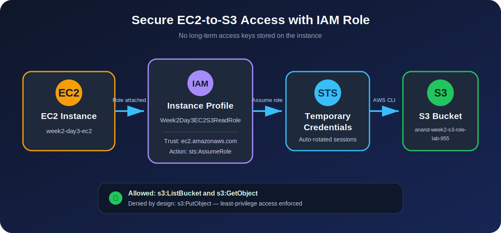

## Topics Practiced

- Trust policy vs permission policy
- `sts:AssumeRole`
- EC2 roles and instance profiles
- AWS STS temporary credentials
- Least-privilege S3 access
- Allowed and denied permission testing

## What I Built

I created the IAM role `Week2Day3EC2S3ReadRole` for the EC2 service. Its inline policy grants only `s3:ListBucket` and `s3:GetObject` permissions on `anand-week2-s3-role-lab-955`. I attached the role to the EC2 instance `week2-day3-ec2` through an instance profile.

The relevant JSON policies are available in the [`policies`](policies) directory.

## Verification Evidence

| Test | Expected result | Actual result |
| --- | --- | --- |
| Assume EC2 role | Temporary role session created | ✅ Passed |
| List S3 bucket | Allowed | ✅ Passed |
| Download S3 object | Allowed | ✅ Passed |
| Upload S3 object | Denied | ✅ `AccessDenied` |

### 1. Trust Relationship

The trust policy allows the EC2 service principal to call `sts:AssumeRole`.

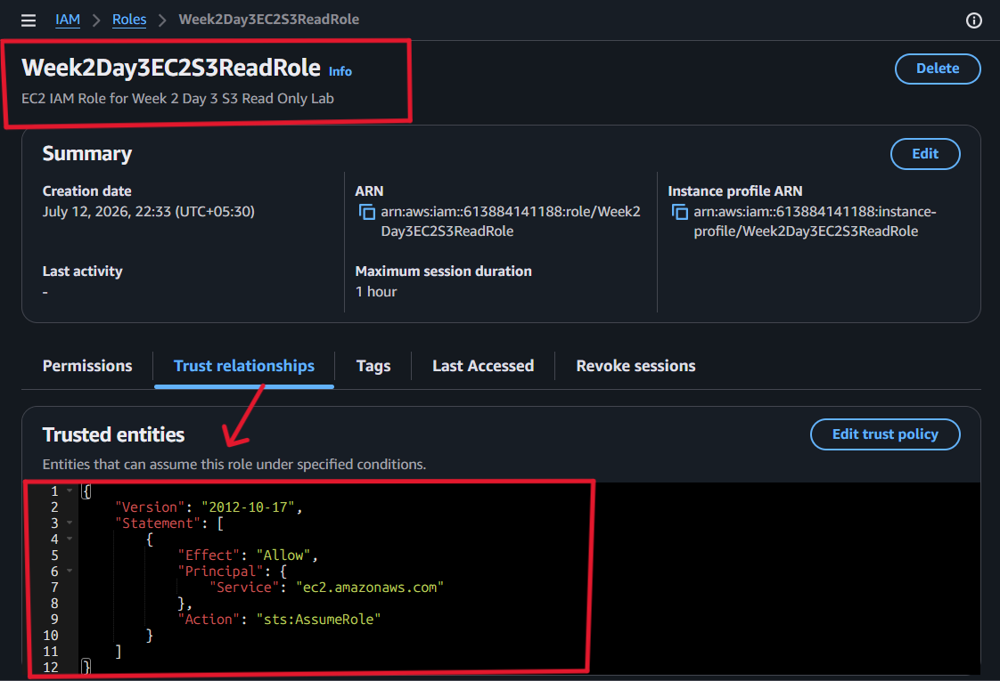

### 2. Least-Privilege Permission Policy

The inline policy permits bucket listing and object reads only.

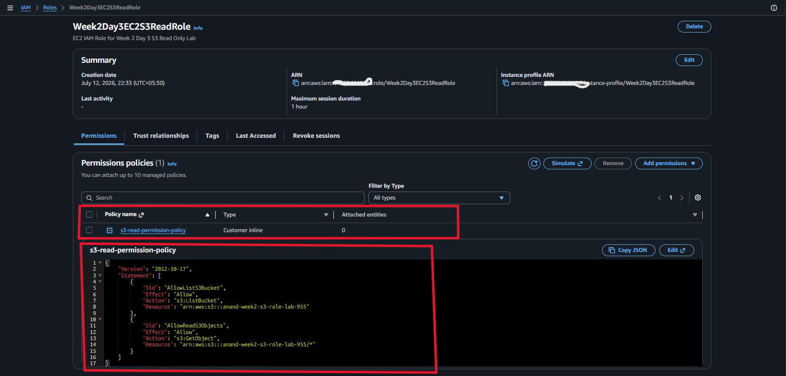

### 3. IAM Role Attached to EC2

The role was attached to the running EC2 instance through its instance profile.

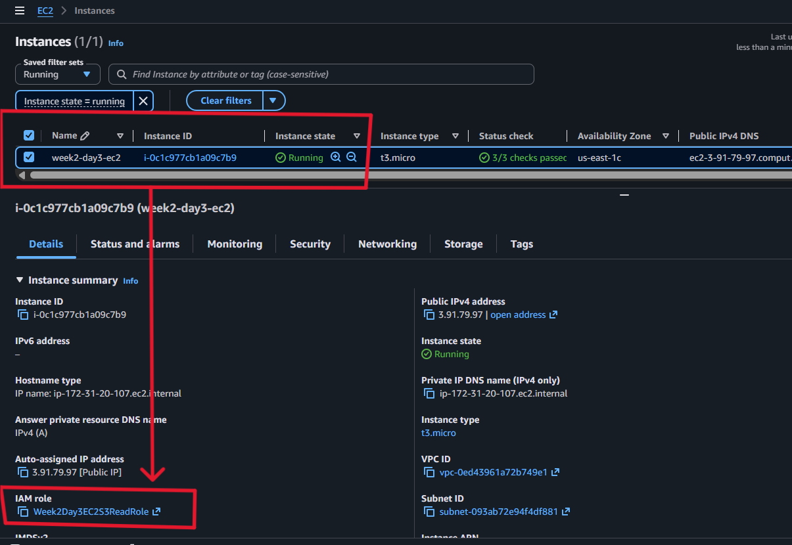

### 4. Temporary Credentials Verification

`aws sts get-caller-identity` confirms that the CLI session is using the assumed EC2 role.

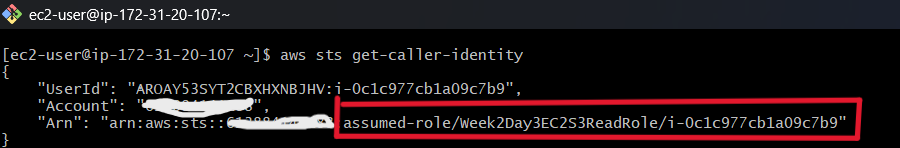

`aws configure list` reports `iam-role` as the credential source, confirming that no static profile credentials were configured.

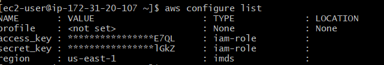

### 5. Allowed Read Test

The instance successfully listed the bucket, downloaded `day3-test.txt.txt`, and read its contents.

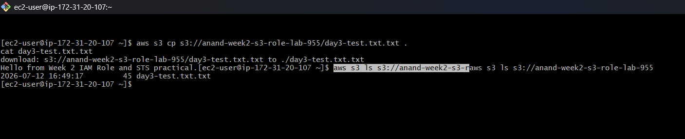

### 6. Denied Write Test

An attempted upload failed with `AccessDenied` because the role does not grant `s3:PutObject`. This demonstrates that least privilege is enforced.

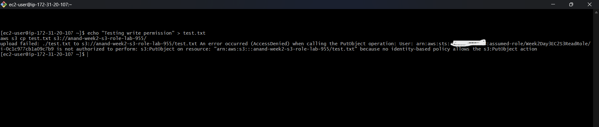

## Cleanup Evidence

The EC2 instance was terminated and the S3 bucket and IAM role were removed after the lab.

### EC2 Instance Terminated

The terminated-instance filter returned no matching EC2 instances.

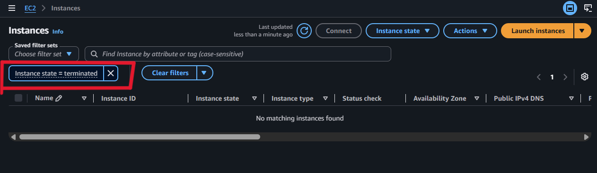

### S3 Bucket Deleted

Searching for the lab bucket returned no matching S3 buckets.

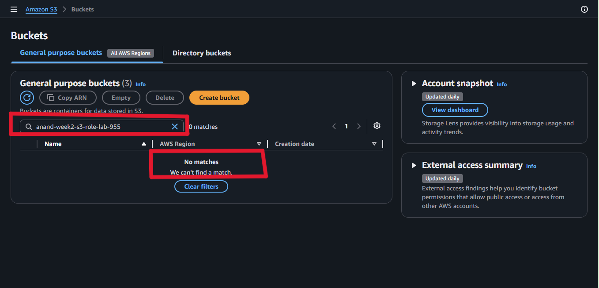

### IAM Role Deleted

Searching for the lab role returned no matching IAM roles.

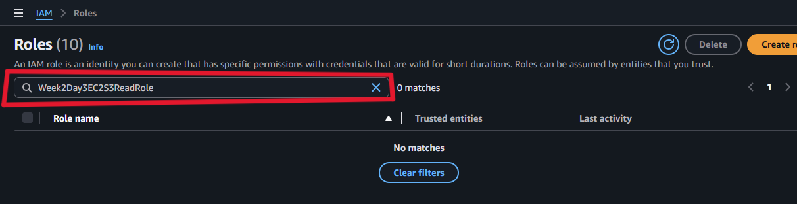

## What I Learned

This lab demonstrated how IAM roles and AWS STS let workloads access AWS services securely without long-lived access keys. A trust policy determines who can assume a role, while a permission policy determines what the assumed role may do. The successful read and denied write tests confirmed that the policy followed the principle of least privilege.

Detailed takeaways are recorded in [`notes.md`](notes.md).

## Security Note

No access key, secret access key, or session token has been committed to this submission.

---

[Back to Week 2](../../../README.md) · [View trust policy](policies/trust-policy.json) · [View S3 read policy](policies/s3-read-policy.json)
