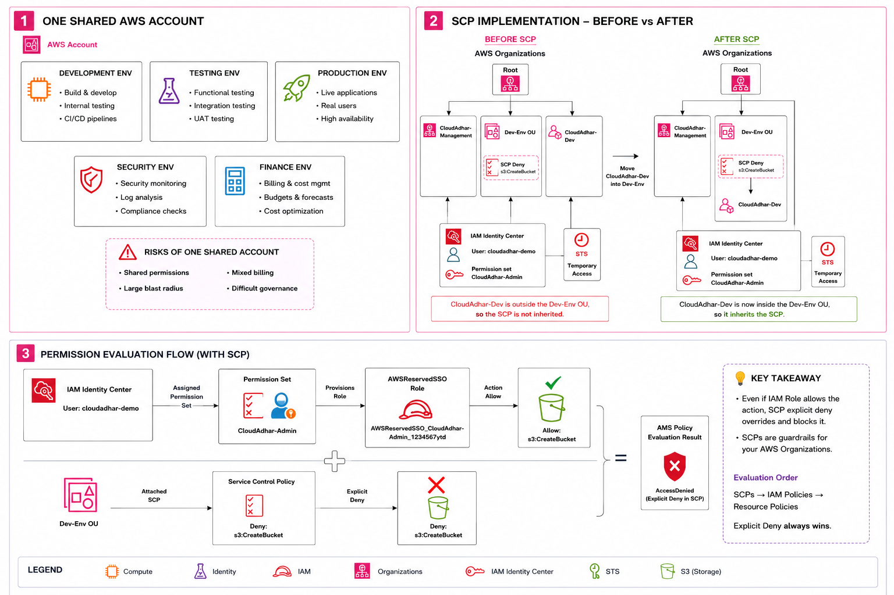
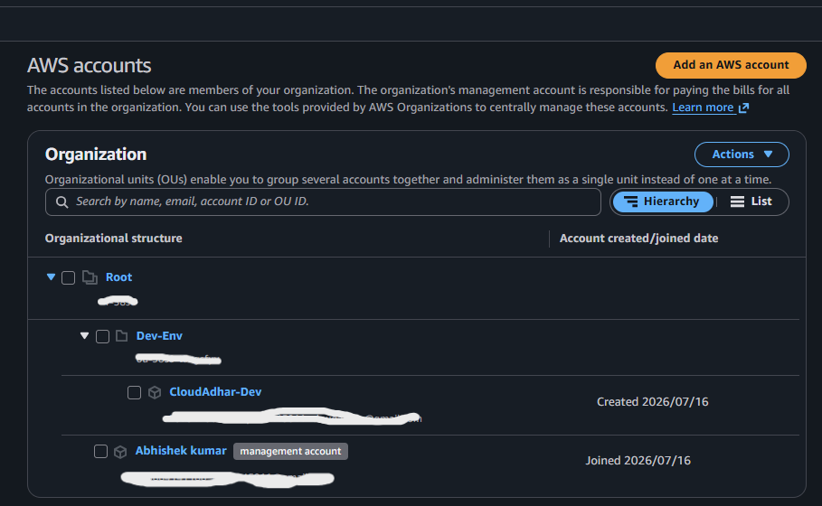
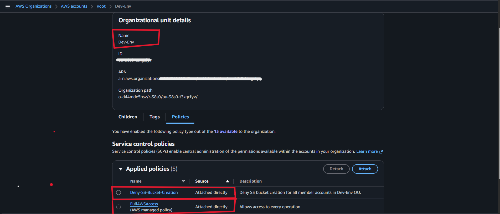
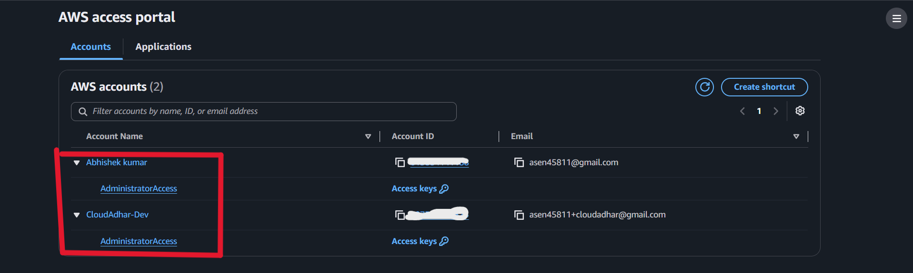

# Week 2 - Day 4: Organizations, Identity Center, and SCPs

## Name

Anand Sen

## Tasks Completed

- [x] Studied AWS Organizations, organizational units, and Service Control Policies
- [x] Created a management account and development member account structure
- [x] Created the `Dev-Env` organizational unit
- [x] Configured AWS IAM Identity Center access
- [x] Attached `Deny-S3-Bucket-Creation` SCP to the `Dev-Env` OU
- [x] Added screenshots as proof of the implementation

---

# Architecture Diagram



---

## Topics Practiced

- AWS Organizations account and Organizational Unit (OU) management
- AWS IAM Identity Center
- Permission sets and AWSReservedSSO roles
- Service Control Policies (SCPs)
- AWS STS temporary credentials
- Amazon S3 permissions and explicit deny evaluation
- Multi-account governance and centralized billing

---

# What I Built

I created an AWS Organizations environment to understand how centralized governance works with Service Control Policies.

- Organized accounts under AWS Organizations using the `Root` and `Dev-Env` OU.
- Used AWS IAM Identity Center to access both AWS accounts with `AdministratorAccess`.
- Attached the `Deny-S3-Bucket-Creation` SCP directly to the `Dev-Env` OU.
- Confirmed that member accounts inside `Dev-Env` inherit the SCP.
- Documented how an SCP explicit deny overrides an IAM allow.

| Resource | Value |
| --- | --- |
| Organizational unit | `Dev-Env` |
| Member account | `CloudAdhar-Dev` |
| Management account | `Abhishek kumar` |
| SCP | `Deny-S3-Bucket-Creation` |
| Restricted action | `s3:CreateBucket` |
| Access method | AWS IAM Identity Center |

---

# Part 1 - Review AWS Organization

Verified the AWS Organizations hierarchy, including the Root, `Dev-Env` OU, management account, and development member account.

## AWS Organizations Overview



## Dev-Env SCP Attached



**Result**

- Confirmed that the `Dev-Env` OU exists under the organization Root.
- Confirmed that the development account is organized under the correct OU.
- Verified that `Deny-S3-Bucket-Creation` is attached to `Dev-Env`.

---

# Part 2 - Verify IAM Identity Center Access

Signed in through the AWS access portal and verified access to the assigned AWS accounts and permission set.

## AWS Access Portal



**Result**

- Verified access to the management and development accounts.
- Verified the available `AdministratorAccess` permission set.
- Used centralized sign-in instead of creating separate IAM users in each account.

---

# Part 3 - Understand SCP Inheritance

The SCP applies according to the account location in AWS Organizations.

```text
Account outside Dev-Env OU  -> SCP is not inherited
Account moved into Dev-Env OU -> SCP is inherited
SCP explicit deny            -> action fails with AccessDenied
```

In this lab, the `Deny-S3-Bucket-Creation` policy acts as a guardrail for accounts in the `Dev-Env` OU. It denies `s3:CreateBucket` even if the assigned IAM role allows the action.

---

# Part 4 - Permission Evaluation Flow

AWS evaluates identity permissions and organization-level restrictions together.

```text
IAM Identity Center permission set
            |
            v
AWSReservedSSO role permits an action
            |
            v
Service Control Policy evaluates organization guardrails
            |
            v
Explicit SCP deny -> AccessDenied
```

**Key takeaway:** SCPs do not grant permissions. They define the maximum permissions available to accounts in an organization. An explicit deny in an SCP always overrides an IAM allow.

---

# What I Learned

- AWS Organizations makes multi-account management easier and more secure.
- Organizational units allow policies to be applied to groups of accounts.
- IAM Identity Center provides centralized, temporary access to multiple AWS accounts.
- SCPs are organization-level guardrails, not IAM permission grants.
- The account must be inside the target OU to inherit the attached SCP.
- Explicit deny wins during AWS permission evaluation.

---

## Where I Got Stuck

At first, it was confusing why an administrator role could still be blocked from creating an S3 bucket. I learned that IAM policies allow permissions inside an account, while SCPs set a higher organization-level boundary. Once the development account was placed inside the `Dev-Env` OU, the SCP restriction applied to it.

---

## Security Note

No access keys, secret keys, account IDs, or session tokens are included in this submission.

---

## Cleanup

- Reviewed the AWS Organizations hierarchy and SCP scope.
- Kept the SCP limited to the `Dev-Env` OU.
- Removed test resources that were not needed after the lab.
- Verified that no unnecessary billable resources remained.

---

## LinkedIn Post

[LinkedIn Link](YAHAN_APNA_LINKEDIN_POST_LINK_DAALNA)

---

[Back to Week 2](../../../README.md)
