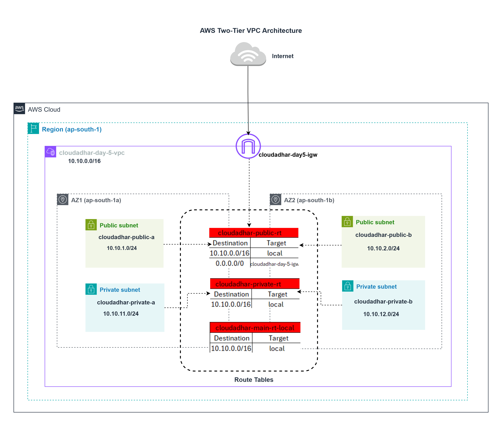
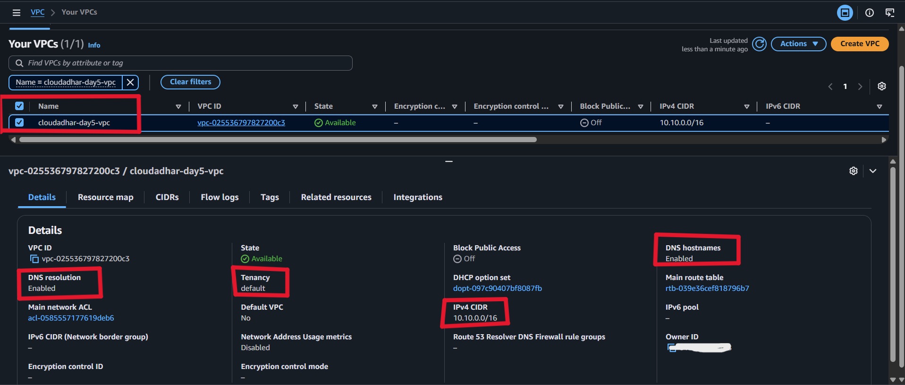
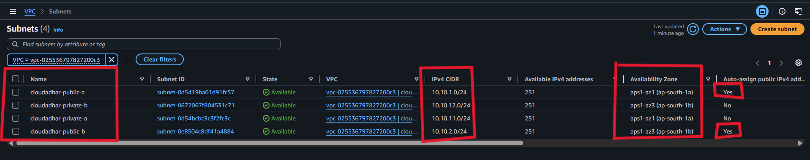
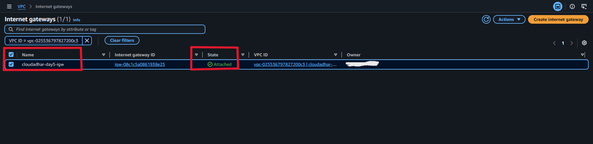
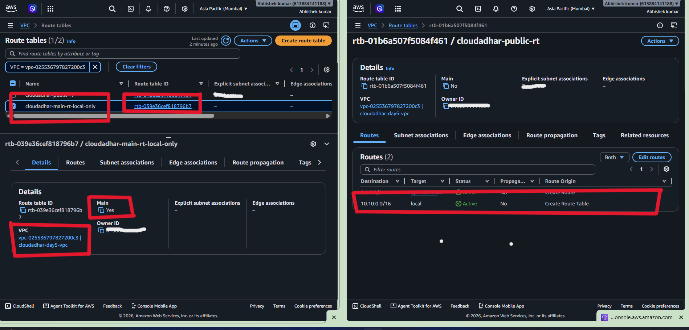
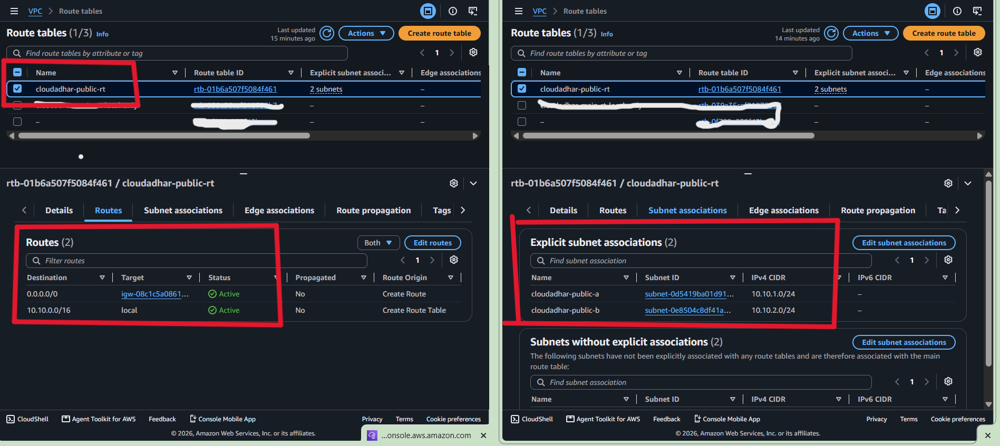
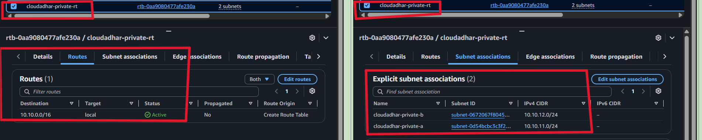
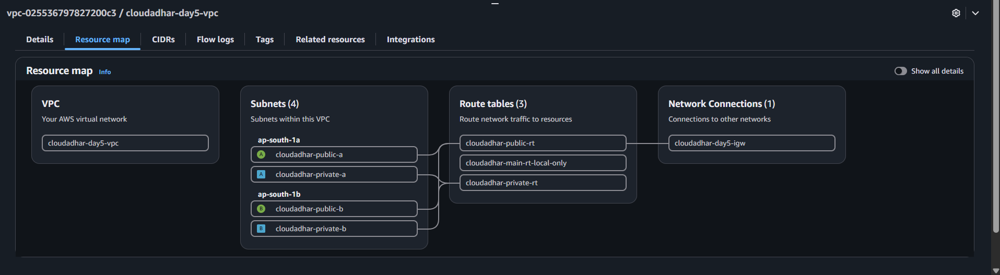

# Day 5 — Two-AZ VPC Fundamentals (Part 1)

## Learner

Anand  Sen

## Objective

Create a custom VPC in Mumbai with two public and two private subnets across two Availability Zones. The public subnets use an Internet Gateway route; the private subnets deliberately have no internet egress in Part 1.

## Architecture

## Build Summary

| Component | Configuration |
|---|---|
| Region | `ap-south-1` (Mumbai) |
| VPC | `cloudadhar-day5-vpc` — `10.10.0.0/16` |
| Public subnets | `cloudadhar-public-a`, `cloudadhar-public-b` |
| Private subnets | `cloudadhar-private-a`, `cloudadhar-private-b` |
| Internet Gateway | `cloudadhar-day5-igw` |
| Main route table | `cloudadhar-main-rt-local-only` |
| Public route table | `cloudadhar-public-rt` |
| Private route table | `cloudadhar-private-rt` |

## CIDR Plan

| Subnet | Availability Zone | CIDR | Auto-assign public IPv4 |
|---|---|---|---|
| `cloudadhar-public-a` | `ap-south-1a` | `10.10.1.0/24` | Enabled |
| `cloudadhar-private-a` | `ap-south-1a` | `10.10.11.0/24` | Disabled |
| `cloudadhar-public-b` | `ap-south-1b` | `10.10.2.0/24` | Enabled |
| `cloudadhar-private-b` | `ap-south-1b` | `10.10.12.0/24` | Disabled |

Every subnet fits inside `10.10.0.0/16`, and none of the subnet ranges overlap.

## Routing Validation

- The main route table remains local-only and is not explicitly associated with a lab subnet.
- `cloudadhar-public-rt` contains the VPC local route plus `0.0.0.0/0` targeting `cloudadhar-day5-igw`; it is explicitly associated with both public subnets.
- `cloudadhar-private-rt` contains only the VPC local route and is explicitly associated with both private subnets.
- No EC2 instance or NAT Gateway was created in this Part 1 lab.

## Evidence

### 1. VPC created

### 2. Four subnets created

### 3. Internet Gateway attached

### 4. Main route table

### 5. Public route table and associations

### 6. Private route table and associations

### 7. Final VPC resource map

## Notes and Learning

A subnet becomes public because of its route table, not its name. In this build, only the public route table has an internet route through the IGW. The private route table has no default route, so private subnets have no outbound IPv4 internet path until a later lab adds controlled egress.

## Cost and Safety

This Part 1 build creates no EC2 instances and no NAT Gateways. The VPC is retained for the next practical; delete the custom resources in dependency order only when the course work is complete.
