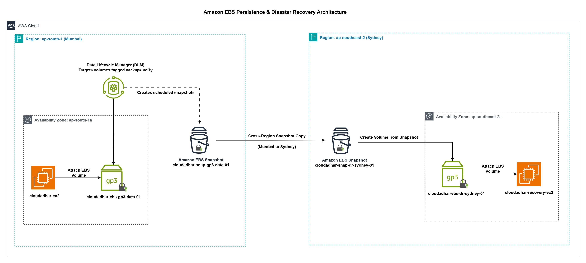

# Week 4 - Day 8: EBS Persistence, EFS, and Storage Recovery

## Name
Anand Sen

## Tasks Completed
- [x] Watched/read the weekly content
- [x] Completed hands-on labs
- [x] Added screenshots or proof
- [x] Posted on LinkedIn
- [x] Cleaned up AWS resources

## Architecture

**`Amazon EBS Persistence & Disaster Recovery Architecture`**

## Architecture Overview

- EC2 instance uses an encrypted **EBS gp3 volume** for durable block-level storage.
- EBS volumes are tied to a **single Availability Zone**, so attachment is only possible within that same AZ.
- **AWS Data Lifecycle Manager (DLM)** runs scheduled snapshot jobs automatically for any volume carrying the **`Backup=Daily`** tag.
- Since **EBS snapshots live at the Regional level**, they can be replicated into a different AWS Region entirely.
- In this setup, the snapshot moves from **Mumbai (ap-south-1)** across to **Sydney (ap-southeast-2)** to support disaster recovery.
- An encrypted volume is then rebuilt from that copied snapshot and mounted onto a dedicated **Recovery EC2** instance.
- End result: durable storage, hands-off backup scheduling, and a working cross-region DR path.

---

**`Amazon EFS Shared Storage Architecture`**

## Architecture Overview

- Two EC2 instances, spread across separate AZs, both mount a common **Amazon EFS** file system.
- EFS operates at the **Regional level** and keeps data replicated across multiple AZs by default — built-in durability and availability.
- Each AZ gets its own **EFS Mount Target**, keeping latency low for the EC2 instance sitting in that zone.
- Instances connect to EFS using the **NFS protocol over TCP port 2049** via their local mount target.
- **Security Group rules** permit inbound NFS (TCP 2049) traffic from the EC2 instances toward the EFS mount targets.
- Both instances can read and write to the same EFS file system concurrently without conflict.
- Net result: a shared, highly available, horizontally accessible storage layer across AZs.

---

## Decision Table

| Requirement | Choice | Reason |
|---|---|---|
| Persistent block storage for EC2 | Amazon EBS gp3 | Cost-effective SSD-backed block storage suited for general workloads. |
| Encrypt data at rest | EBS Encryption | KMS-backed encryption protects both volumes and their snapshots. |
| Hands-off backup scheduling | AWS Data Lifecycle Manager (DLM) | Automates snapshot creation on a defined schedule via tag-based policies. |
| Recover to a specific point in time | EBS Snapshot | Point-in-time backup that can be used to rebuild a volume later. |
| Survive a full Regional outage | Cross-Region Snapshot Copy | Replicates the snapshot into a second AWS Region for DR purposes. |
| Rebuild storage post-failure | New EBS Volume from Snapshot | Recreates the volume in the target Region/AZ from the copied snapshot. |
| Bring compute back online | Recovery EC2 Instance | Attaches the rebuilt volume so workloads can resume. |
| AZ-bound storage behavior | Amazon EBS | Volumes only attach to instances within the same AZ they were created in. |
| Region-level backup artifact | Amazon EBS Snapshots | Snapshots persist at the Region level and can seed new volumes anywhere in-region. |

---

## Result

Completed hands-on work covering EBS persistence, snapshot-based disaster recovery, cross-Region backup copy, reviewing a DLM policy, Placement Groups, and Amazon EFS shared storage. Also worked through the optional add-ons — Fast Snapshot Restore, io2 Multi-Attach, and Instance Store behavior validation.

---

# Part 1: Amazon EBS Persistence

**Resources created:**

- Storage EC2 **`cloudadhar-ec2-storage-lab-01`**
- Security Group **`cloudadhar-sg-storage-lab`**
- gp3 Volume **`cloudadhar-ebs-gp3-data-01`**

**Validation:** Created and attached an encrypted gp3 volume, mounted it persistently using its UUID, confirmed the data survived both a reboot and a full stop/start cycle, and grew the volume from 2 GiB to 4 GiB.

### 1. Storage EC2 Running

---

### 2. gp3 Volume Attached

---

### 3. XFS Filesystem Mounted using UUID

---

### 4. Data Persistence Validation

---

### 5. Volume Expansion (2 GiB → 4 GiB)

---

# Part 2: Snapshot & Disaster Recovery

**Resources created:**

- Snapshot **`cloudadhar-snap-gp3-data-01`**
- Restored Volume **`cloudadhar-ebs-gp3-restored-01`**
- Sydney DR Snapshot **`cloudadhar-snap-dr-sydney-01`**

**Validation:** Restored a volume from its snapshot successfully, confirmed the point-in-time recovery worked as expected, copied the encrypted snapshot from Mumbai over to Sydney, and double-checked encryption held across every resource involved.

### 6. Snapshot Completed

---

### 7. Restored Volume Validation

---

### 8. Cross-Region Snapshot Copy & Encryption Validation

---

# Part 3: Backup Automation

**Resources created:**

- DLM Policy **`cloudadhar-dlm-daily-ebs-snapshots`**

**Validation:** Reviewed the DLM policy configuration and confirmed it only targets volumes carrying the **`Backup=Daily`** tag.

### 9. Data Lifecycle Manager Policy

---

# Part 4: Placement Groups

**Resources created:**

- **`cloudadhar-pg-cluster-demo`**
- **`cloudadhar-pg-spread-demo`**
- **`cloudadhar-pg-partition-demo`**

**Validation:** Set up and reviewed all three placement group strategies — Cluster, Spread, and Partition.

### 10. Placement Groups

---

# Part 5: Amazon EFS Shared Storage

**Resources created:**

- EFS **`cloudadhar-efs-shared-01`**
- Security Group **`cloudadhar-sg-storage-lab`**, **`cloudadhar-sg-efs-nfs`**
- Client 1 **`cloudadhar-ec2-efs-client-01`**
- Client 2 **`cloudadhar-ec2-efs-client-02`**

**Validation:** Mounted the same EFS file system on two separate EC2 instances, confirmed both could read/write shared files, and set up persistent mounting through `/etc/fstab`.

### 11. Amazon EFS File System

---

### 12. Client 1 Mounted Amazon EFS

---

### 13. Client 2 Shared Access Validation

---

### 14. Persistent Amazon EFS Mount Validation

---

# Part 6: Enable & Disable Fast Snapshot Restore

**Resources used:**

- Snapshot **`cloudadhar-snap-gp3-data-01`**

**Validation:** Enabled Fast Snapshot Restore on the Mumbai snapshot for the target AZ, confirmed the status showed Enabled, then turned it back off and verified it was no longer active.

### 15. Fast Snapshot Restore Enable & Disable

---

---

# Part 7: io2 Multi-Attach

**Resources created:**

- io2 Multi-Attach Volume **`cloudadhar-ebs-io2-multiattach-01`**
- EC2 Instance **`cloudadhar-ec2-multiattach-01`**, **`cloudadhar-ec2-multiattach-02`** (`t3.large`)

**Validation:** Created an encrypted io2 volume with Multi-Attach enabled, attached it to both instances (same AZ) simultaneously, confirmed both instances saw the shared block device via `lsblk`, and tore everything down after validation.

### 17. Create io2 Multi-Attach Volume

---

### 18. Attach Volume to Both EC2 Instances

---

### 19. Verify Multi-Attach on Primary EC2

---

### 20. Verify Multi-Attach on Secondary EC2

---

# Part 8: Instance Store

**Resources created:**

- EC2 Instance **`cloudadhar-ec2-instance-store-01`** (`i3.large`)

**Validation:** Verified the local NVMe Instance Store, formatted it with XFS and mounted it, confirmed read/write worked using a test file (`temporary.txt`), checked the file survived a reboot, then confirmed it — and the mount itself — disappeared after a stop/start cycle, proving Instance Store's ephemeral nature.

### 21. Launch & Verify Instance Store

---

### 22. Mount and Configure Instance Store

---

### 23. Verify After Reboot

---

### 24. Verify After Stop & Start

---

## Where I Got Stuck

`No blocker`

---

## Cleanup

### Amazon EBS Cleanup

1. Unmounted and deleted `cloudadhar-ebs-gp3-restored-01`.
2. Deleted `cloudadhar-snap-gp3-data-01`.
3. Deleted `cloudadhar-snap-dr-sydney-01`.
4. Deleted `cloudadhar-ebs-gp3-data-01`.
5. Deleted `cloudadhar-dlm-daily-ebs-snapshots`.
6. Terminated `cloudadhar-ec2-storage-lab-01`.
7. Deleted `cloudadhar-sg-storage-lab`.

### Amazon EFS Cleanup

1. Unmounted EFS from both EC2 instances.
2. Deleted `cloudadhar-efs-shared-01`.
3. Deleted `cloudadhar-sg-efs-nfs`.
4. Terminated `cloudadhar-ec2-efs-client-01`.
5. Terminated `cloudadhar-ec2-efs-client-02`.

### Placement Groups Cleanup

1. Deleted `cloudadhar-pg-cluster-demo`.
2. Deleted `cloudadhar-pg-spread-demo`.
3. Deleted `cloudadhar-pg-partition-demo`.

### Optional Demonstrations Cleanup

1. Deleted `cloudadhar-ebs-io2-multiattach-01`.
2. Terminated `cloudadhar-ec2-multiattach-01`.
3. Terminated `cloudadhar-ec2-multiattach-02`.
4. Terminated `cloudadhar-ec2-instance-store-01`.

---

## LinkedIn Post
[LinkedIn Link](YOUR_LINKEDIN_POST_URL_HERE)
