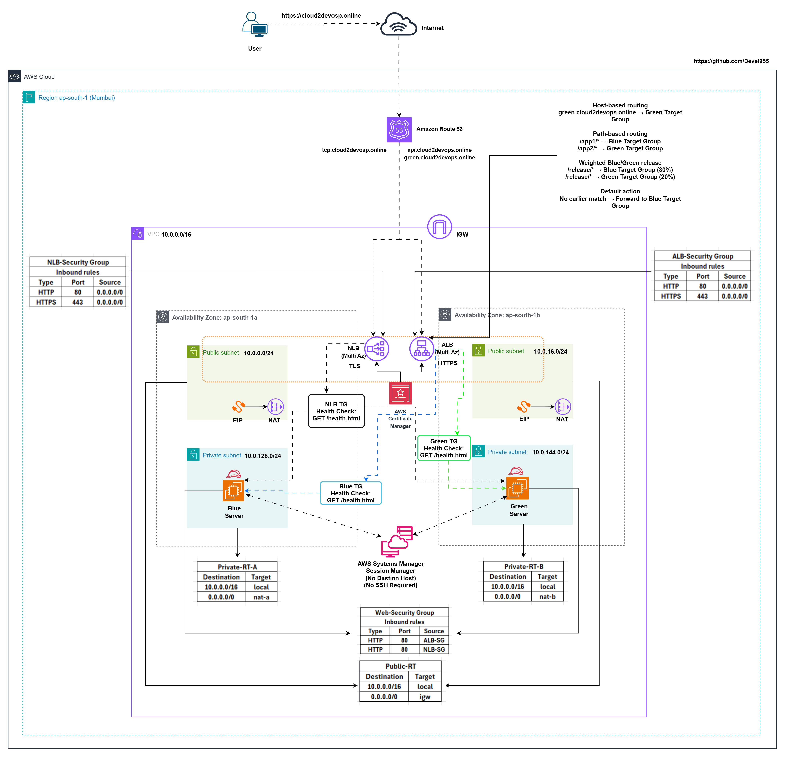
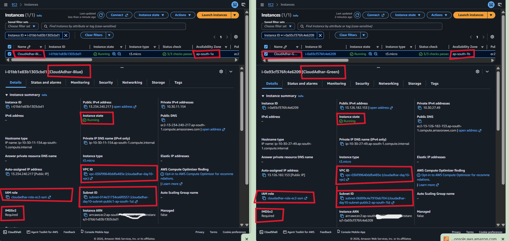
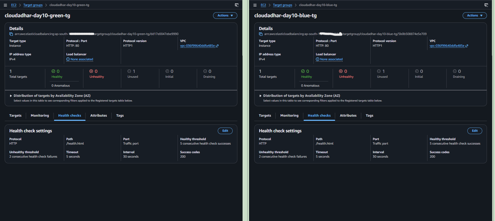
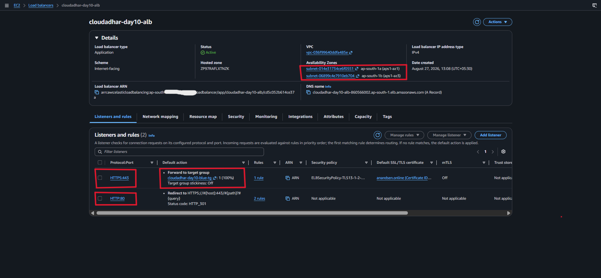
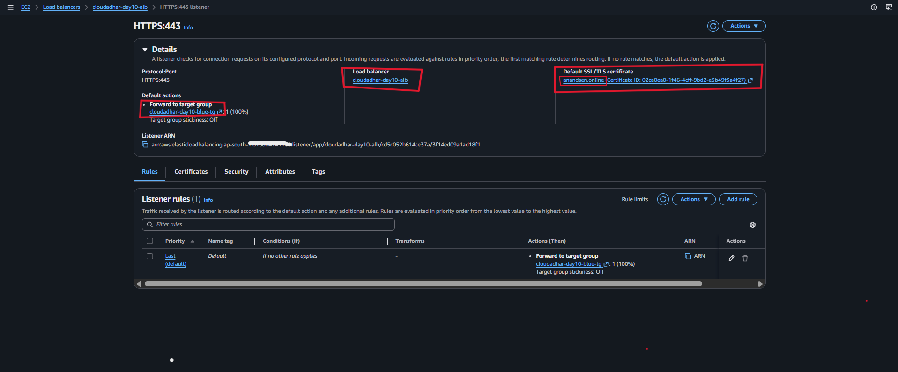
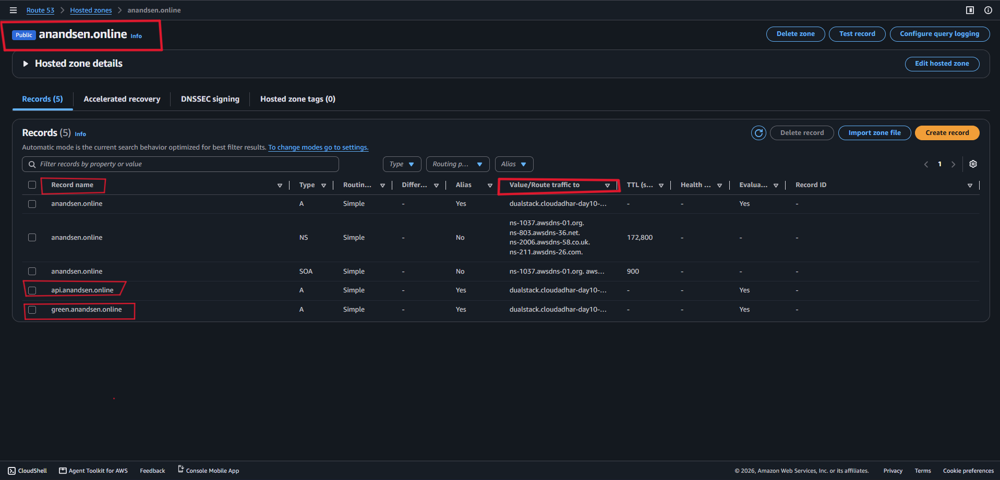
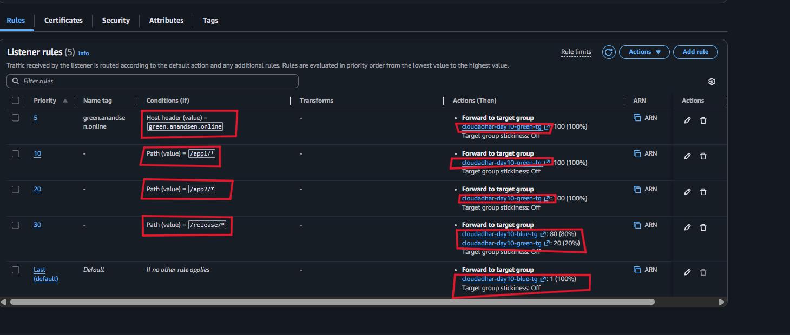
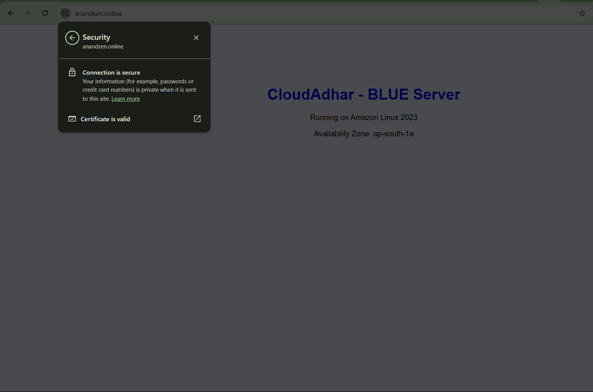
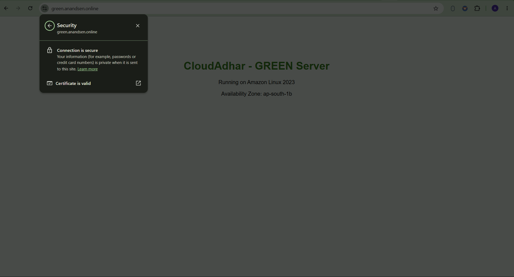
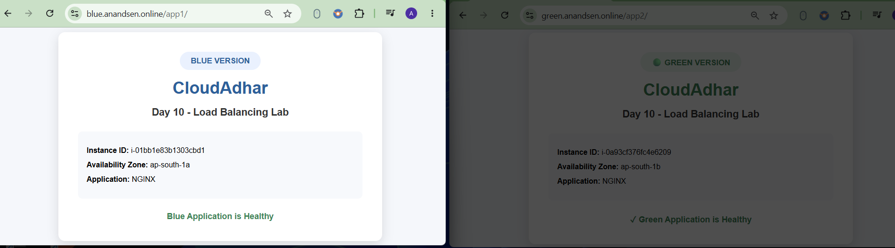

# Week 5 - Day 10: ALB Blue/Green Routing and NLB

## Name
Anand Sen

## Tasks Completed
- [x] Watched/read the weekly content
- [x] Completed hands-on labs
- [x] Added screenshots or proof
- [x] Posted on LinkedIn
- [x] Cleaned up AWS resources

## Architecture



## Architecture Overview

- **Amazon VPC:** Deployed a dedicated VPC in the **ap-south-1 (Mumbai)** Region, spanning **two Availability Zones**, with public and private subnets for a highly available, fault-tolerant network.
- **Networking:** Public subnets host the internet-facing **ALB**, **NLB**, and **NAT Gateway**, while Blue and Green EC2 instances live in private subnets for secure application hosting.
- **Application Load Balancer (ALB):** Set up an internet-facing ALB with **HTTPS** enabled via an **ACM wildcard certificate**. Configured **host-based routing**, **path-based routing**, **weighted Blue/Green traffic splitting**, **target group stickiness**, **health checks**, and **connection draining** to demonstrate Layer 7 traffic management.
- **Network Load Balancer (NLB):** Deployed an internet-facing NLB with a **TLS listener** using the same ACM certificate, providing secure **Layer 4 TCP/TLS** load balancing.
- **Amazon EC2:** Blue and Green NGINX web servers run in private subnets across two AZs, each registered with its own ALB and NLB target groups.
- **DNS & Certificates:** Configured **Route 53 Alias records** for the ALB (`api.anandsen.online`, `green.anandsen.online`) and the NLB (`tcp.anandsen.online`), all secured using an ACM wildcard certificate.
- **Connectivity & Security:** An Internet Gateway, NAT Gateway, route tables, and Security Groups keep public resources reachable while backend EC2 instances stay private.
- **Administration:** Instance access handled via AWS Systems Manager Session Manager — no bastion host, no inbound SSH.
- **Why this design:** Delivers a secure, highly available, production-style load balancing setup demonstrating **Layer 7 routing**, **Layer 4 load balancing**, **Blue/Green deployment**, **traffic shifting**, **stickiness**, **health monitoring**, and **connection draining**, aligned with the AWS Well-Architected Framework.

> **Note:** The diagram shows a production pattern with **one NAT Gateway per AZ**. This lab used a **single NAT Gateway** to keep costs down while covering the same core concepts.

---

## Result

Built out an ALB with advanced Layer 7 routing alongside an NLB for Layer 4 traffic distribution. Configured HTTPS on the ALB and TLS on the NLB using an ACM wildcard certificate plus Route 53 alias records. Verified host-based routing, path-based routing, weighted Blue/Green traffic splitting, target group stickiness, health checks, connection draining, and secure load balancing across both EC2 instances.

**Resources created:**

- VPC `cloudadhar-day10-vpc`
- Public Subnets (for ALB, NLB, and NAT Gateway)
- Private Subnets (for Blue and Green EC2 instances)
- Internet Gateway
- NAT Gateway
- Elastic IP associated with NAT Gateway
- Blue EC2 `cloudadhar-day10-blue-ec2`
- Green EC2 `cloudadhar-day10-green-ec2`
- Blue Target Group `cloudadhar-day10-blue-tg`
- Green Target Group `cloudadhar-day10-green-tg`
- Application Load Balancer `cloudadhar-day10-alb`
- NLB Target Group `cloudadhar-day10-nlb-tg`
- Network Load Balancer `cloudadhar-day10-nlb`
- ACM Wildcard Certificate `*.anandsen.online`
- Route 53 Alias Record `api.anandsen.online`
- Route 53 Alias Record `green.anandsen.online`
- Route 53 Alias Record `tcp.anandsen.online`
- ALB Security Group `cloudadhar-day10-alb-sg`
- NLB Security Group `cloudadhar-day10-nlb-sg`
- Web Security Group `cloudadhar-day10-web-sg`

**Validation:** Verified HTTPS access through the ALB using `https://api.anandsen.online`, host-based routing via `https://green.anandsen.online`, TLS access through the NLB via `https://tcp.anandsen.online`, Route 53 DNS resolution, healthy Blue and Green target registration, path-based routing, weighted Blue/Green release, target group stickiness, unhealthy target detection and recovery, connection draining, and Layer 4 TLS load balancing through the NLB.

---

### 1. Blue and Green EC2 Instances

Launched Blue and Green EC2 instances in different AZs on Amazon Linux 2023, with IMDSv2 enforced and User Data configuring NGINX automatically.



---

### 2. Target Group Configuration

Created the Blue and Green Target Groups with HTTP health checks on `/health.html` and registered the matching EC2 instances.



---

### 3. Application Load Balancer

Set up the internet-facing ALB across two AZs, with HTTP (80) and HTTPS (443) listeners for secure access.



---

### 4. ALB HTTPS Listener with ACM Certificate

Configured the HTTPS (443) listener using the ACM wildcard certificate `*.anandsen.online` and redirected all HTTP traffic to HTTPS.



---

### 5. Route 53 DNS Records

Created Route 53 Alias records:

- `api.anandsen.online` → Application Load Balancer
- `green.anandsen.online` → Application Load Balancer



---

### 6. ALB Listener Rules

Configured the HTTPS listener with these routing rules:

- **Host-based routing**
  - `green.anandsen.online` → Green Target Group

- **Path-based routing**
  - `/app1/*` → Blue Target Group
  - `/app2/*` → Green Target Group

- **Weighted Blue/Green release**
  - `/release/*` → Blue Target Group (80%)
  - `/release/*` → Green Target Group (20%)

- **Default action**
  - No earlier match → Forward to Blue Target Group



---

### 7. Healthy Target Registration

Confirmed both Blue and Green EC2 instances passed their health checks and reached the **Healthy** state.


---

### 8. Default HTTPS Validation

Verified secure HTTPS access via `https://api.anandsen.online` and confirmed the default listener served the **Blue** application with a valid ACM certificate.



---

### 9. Host-Based Routing

Confirmed requests to `https://green.anandsen.online` matched the host-based rule and were forwarded to the Green Target Group, with a valid ACM certificate securing the connection.



---

### 10. Path-Based Routing

Validated the path-based routing rules:

- `https://api.anandsen.online/app1/` → Blue Target Group (Blue Version)
- `https://api.anandsen.online/app2/` → Green Target Group (Green Version)

Confirmed requests were routed based on the URL path while using the same HTTPS endpoint.



---

### 11. Weighted Blue/Green Release

Ran **500 independent HTTPS requests** against the `/release/` endpoint to validate the weighted routing.

**Command:**

```bash
for i in $(seq 1 500); do
  curl -sk https://api.anandsen.online/release/ \
    | grep -oE "BLUE VERSION|GREEN VERSION"
done | sort | uniq -c
```

**Observed Result:**

```text
401 BLUE VERSION
 99 GREEN VERSION
```

The observed split (~80.2% Blue and ~19.8% Green) closely matched the configured **80:20** weighted rule, confirming the Blue/Green traffic distribution worked as expected.


---

### 12. Target Group Stickiness

Enabled **Target Group Stickiness (300 seconds)** on the weighted rule and confirmed repeated requests from the same client consistently landed on the same target group via the ALB stickiness cookie.


---

### 13. Green Target Unhealthy

Stopped NGINX on the Green EC2 instance and confirmed the Green Target Group marked it **Unhealthy**. Requests to `https://api.anandsen.online/app2/` then returned **502 Bad Gateway** since that target group had no healthy targets.


---

### 14. Green Target Recovery

Restarted NGINX on the Green instance and confirmed it returned to **Healthy** after passing health checks again. Requests to `https://api.anandsen.online/app2/` resumed being served by the Green application.


---

### 15. Connection Draining

Set a **30-second** deregistration delay, started a slow download, deregistered the Blue target, and watched it move through **Healthy → Draining → Unused** before re-registering successfully.


---

### 16. NLB Target Group

Created the NLB Target Group and registered the Blue and Green EC2 instances.


---

### 17. Network Load Balancer

Created the internet-facing NLB with two Layer 4 listeners:

- TCP (80) listener for plain TCP forwarding
- TLS (443) listener using the ACM certificate for encrypted traffic

Both listeners point to the NLB Target Group holding the Blue and Green EC2 instances.

> **Note:** Both TCP (80) and TLS (443) listeners were set up to show Layer 4 capabilities. Validation itself was done via the TLS (443) listener with the ACM certificate.


---

### 18. NLB TLS Listener with ACM Certificate and Route 53 Alias Record

Configured the **TLS (443)** listener using the ACM wildcard certificate `*.anandsen.online`.


Created the Route 53 Alias record:

- `tcp.anandsen.online` → Network Load Balancer

Confirmed successful DNS resolution.


---

### 19. Healthy NLB Targets

Confirmed both Blue and Green EC2 instances passed the NLB health checks and reached **Healthy**.


---

### 20. Secure NLB Validation

Verified secure TLS access via `https://tcp.anandsen.online` and confirmed successful TLS termination at the NLB.


---

### 21. NLB Traffic Distribution

Confirmed Layer 4 TLS load balancing through `https://tcp.anandsen.online` on the NLB's TLS (443) listener.

Repeated HTTPS requests from AWS CloudShell confirmed traffic was distributed across both Blue and Green backend instances. Browser access also confirmed the app was reachable through the NLB endpoint.


---

## Where I Got Stuck

`No blocker`

---

## Cleanup

Resources deleted during cleanup (in order):

- Deregistered Blue and Green EC2 instances from Target Groups
- Terminated EC2 instances:
  - `cloudadhar-day10-blue-ec2`
  - `cloudadhar-day10-green-ec2`
- Deleted Application Load Balancer `cloudadhar-day10-alb`
- Deleted Network Load Balancer `cloudadhar-day10-nlb`
- Deleted ALB Target Groups:
  - `cloudadhar-day10-blue-tg`
  - `cloudadhar-day10-green-tg`
- Deleted NLB Target Group `cloudadhar-day10-nlb-tg`
- Deleted ALB and NLB Security Groups:
  - `cloudadhar-day10-alb-sg`
  - `cloudadhar-day10-nlb-sg`
  - `cloudadhar-day10-web-sg`
- Deleted Route 53 Alias records:
  - `api.anandsen.online`
  - `green.anandsen.online`
  - `tcp.anandsen.online`
- Deleted NAT Gateway and released the associated Elastic IP
- Detached and deleted the Internet Gateway
- Deleted Route Tables and Subnets
- Deleted VPC `cloudadhar-day10-vpc`

---

## LinkedIn Post
[LinkedIn Link](YOUR_LINKEDIN_POST_URL_HERE)
