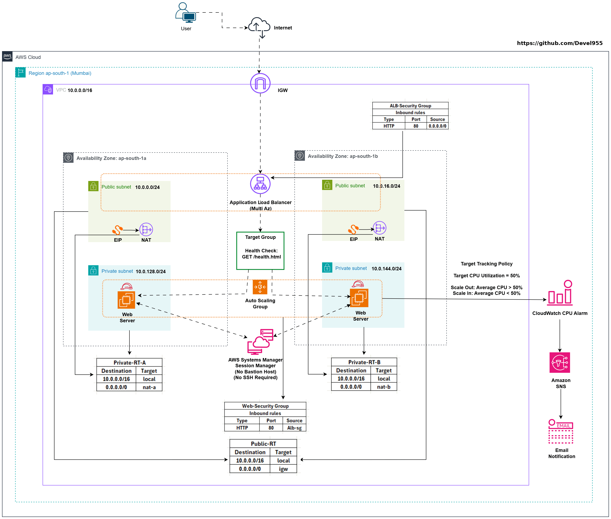

# Week 5 - Day 9: ALB-Backed Auto Scaling

## Name
Anand Sen

## Tasks Completed
- [x] Watched/read the weekly content
- [x] Completed hands-on labs
- [x] Added screenshots or proof
- [x] Posted on LinkedIn
- [x] Cleaned up AWS resources

## Architecture

## Architecture Overview

- **Amazon VPC:** Set up a dedicated VPC (`10.0.0.0/16`) in the **ap-south-1 (Mumbai)** Region, spread across **two Availability Zones**.
- **Networking:** Public subnets host the internet-facing ALB and NAT Gateway, while private subnets keep the EC2 web servers isolated from direct internet exposure.
- **Application Load Balancer (ALB):** An internet-facing ALB distributes incoming HTTP traffic to healthy EC2 instances, with the Target Group performing health checks against **`/health.html`**.
- **EC2 Auto Scaling:** An Auto Scaling Group paired with a Launch Template manages the NGINX-based web servers, handling scale-out, scale-in, and automatic replacement of unhealthy instances.
- **Connectivity & Security:** Internet Gateway, NAT Gateway, route tables, and Security Groups work together to allow controlled outbound internet access while the web tier stays private.
- **Monitoring & Notifications:** CloudWatch tracks CPU utilization to drive Target Tracking scaling decisions, and SNS sends email alerts when alarms trigger.
- **Administration:** Instance access is handled through AWS Systems Manager Session Manager — no bastion host, no inbound SSH needed.
- **Why this design:** Together this gives a **secure, highly available, self-healing, and auto-scaling** setup that lines up with the **AWS Well-Architected Framework**.

> **Note:** The diagram shows a full production pattern with **one NAT Gateway per AZ** for high availability. For this lab, **a single NAT Gateway** was used instead to keep costs down while still demonstrating the core mechanics.

---

## Result

Built out an ALB + Auto Scaling Group setup end to end. Confirmed traffic was load-balanced across multiple EC2 instances, scale-out and scale-in responded correctly to CPU utilization, and the ASG replaced an unhealthy instance automatically.

**Resources created:**

- VPC `cloudadhar-day9-vpc`
- Public Subnets (for ALB and NAT Gateway)
- Private Subnets (for EC2 web servers)
- Internet Gateway
- NAT Gateway
- Elastic IP associated with NAT Gateway
- Launch Template `cloudadhar-day9-lt`
- Application Load Balancer `cloudadhar-day9-alb`
- Target Group `cloudadhar-day9-tg`
- Auto Scaling Group `cloudadhar-day9-asg`
- Target Tracking Policy `cloudadhar-day9-cpu50-policy`
- ALB Security Group `cloudadhar-day9-alb-sg`
- Web Security Group `cloudadhar-day9-web-sg`

**Validation:** Confirmed healthy target registration, correct ALB traffic routing, automatic scale-out under high CPU load, automatic scale-in once load dropped, and self-healing when an EC2 instance was deliberately made unhealthy.

### 1. Launch Template Configuration

Set up the Launch Template `cloudadhar-day9-lt` on Amazon Linux 2023, `t3.micro`, with IMDSv2 enforced, an encrypted gp3 root volume, detailed monitoring enabled, and User Data to install and configure NGINX automatically.

---

### 2. Target Group Configuration

Configured the Target Group `cloudadhar-day9-tg` with HTTP health checks pointed at `/health.html` to track instance health.

---

### 3. Application Load Balancer

Stood up the internet-facing ALB `cloudadhar-day9-alb` with an HTTP listener forwarding requests to the Target Group across both AZs.

---

### 4. Auto Scaling Group

Created the ASG `cloudadhar-day9-asg` from the Launch Template, with `minimum capacity of 1`, `desired capacity of 1`, and `maximum capacity of 2`.

---

### 5. Healthy Target Registration

Confirmed the EC2 instance registered with the Target Group and passed ALB health checks, reaching the Healthy state.

---

### 6. ALB Validation

Verified the ALB correctly routed HTTP requests through to the healthy EC2 instance running the NGINX app.

---

### 7. Target Tracking Scaling Policy

Set up the Target Tracking policy `cloudadhar-day9-cpu50-policy` to keep the ASG's average `CPU utilization around 50%`.

---

### 8. High CPU Alarm Triggered

Loaded the CPU using **stress-ng** and confirmed the CloudWatch High CPU alarm flipped to **ALARM**, kicking off the scale-out process.

---

### 9. Scale-Out Activity

Verified the ASG automatically raised `desired capacity from 1 to 2` once the Target Tracking policy triggered.

---

### 10. Two Healthy EC2 Instances

Confirmed both EC2 instances were up, registered with the Target Group, and reporting Healthy behind the ALB.

---

### 11. Load Balancer Serving Multiple Instances

Sent repeated requests to the ALB and confirmed traffic was being distributed across both healthy instances.

---

### 12. Scale-In Activity

Removed the CPU workload and confirmed the Target Tracking policy scaled `desired capacity back down from 2 to 1` once `average CPU dropped below the 50% target`.

---

### 13. Unhealthy Target Detected

Simulated a failure by stopping the NGINX service on an instance and confirmed the Target Group marked it Unhealthy after the configured health check threshold.

---

### 14. Auto Scaling Replacement

Verified the ASG automatically terminated the unhealthy instance and launched a fresh one to maintain `desired capacity of 1`.

---

### 15. Replacement Instance Healthy

Confirmed the replacement instance passed ALB health checks, registered with the Target Group, and resumed serving traffic.

---

## Where I Got Stuck

`No blocker`

---

## Cleanup

**Auto Scaling and Load Balancer cleanup (in order):**
1. Set desired capacity to **0** on `cloudadhar-day9-asg`, waited for instances to terminate, then deleted the ASG
2. Deleted Application Load Balancer `cloudadhar-day9-alb`
3. Deleted Target Group `cloudadhar-day9-tg`
4. Deleted Launch Template `cloudadhar-day9-lt`
5. Deleted CloudWatch alarms tied to the Target Tracking scaling policy
6. Deleted NAT Gateway and released its Elastic IP
7. Deleted project-specific Security Groups
8. Detached and deleted the Internet Gateway
9. Deleted Route Tables and Subnets
10. Deleted VPC `cloudadhar-day9-vpc`

---

## LinkedIn Post
[LinkedIn Link](YOUR_LINKEDIN_POST_URL_HERE)
