# Day 11 Lab - Private, Versioned, and Protected Amazon S3

## Name
Anand Sen

## Tasks Completed
- [x] Watched/read the weekly content
- [x] Completed hands-on labs
- [x] Added screenshots or proof
- [x] Posted on LinkedIn
- [x] Cleaned up AWS resources

## Architecture

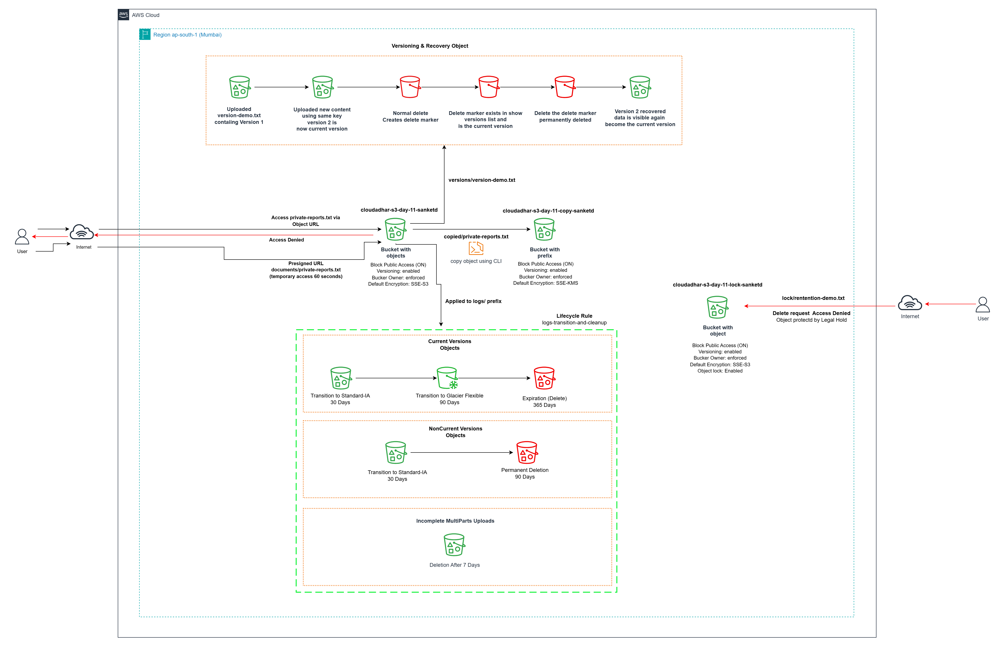

## Result

Worked through a private, versioned, encrypted, and protected S3 setup end to end. Confirmed private bucket access, S3 Versioning combined with delete-marker recovery, an in-bucket object copy that picked up independent SSE-KMS encryption, an S3 Bucket Key, presigned URL access, Lifecycle Management rules, and S3 Object Lock with Legal Hold protection.

**Resources created:**

- Source Bucket `cloudadhar-s3-day11-2026`
- Object Lock Bucket `cloudadhar-s3-day11-lock-anand-2026`
- Customer Managed KMS Key `alias/cloudadhar-s3-day11`
- Lifecycle Rule `logs-transition-and-cleanup`
- S3 prefixes `documents/`, `versions/`, `logs/`, `storage/`, `presigned/`, and `copied/`

**Validation:** Confirmed both buckets stayed private with Block Public Access enabled throughout, Versioning protected objects from a plain delete, the in-bucket copy ended up as an independent SSE-KMS encrypted object, plain Object URLs were rejected while short-lived presigned URLs worked as expected, Lifecycle Management was set up for future transitions and cleanup, and Legal Hold blocked permanent deletion until it was lifted.

### 1. Customer Managed KMS Key

Created the customer managed KMS key `alias/cloudadhar-s3-day11` in the Mumbai region with symmetric encryption and decrypt usage. Confirmed the key showed as enabled.

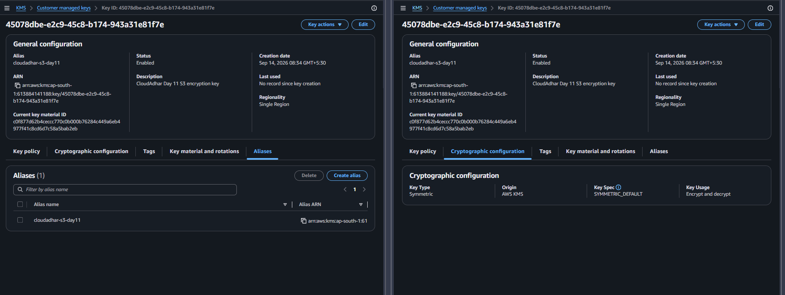

---

### 2. Private Source Bucket

Created the source bucket `cloudadhar-s3-day11-2026` in `ap-south-1`, with Bucket owner enforced, ACLs disabled, all four Block Public Access settings on, Versioning enabled, and SSE-S3 as the default encryption.

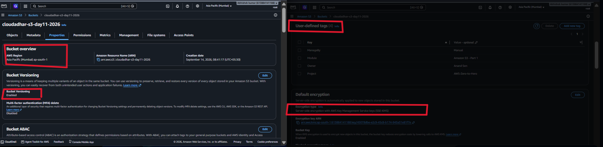

---

### 3. SSE-KMS on Copied Object

Enabled SSE-KMS default encryption on the bucket using `alias/cloudadhar-s3-day11`, with S3 Bucket Key turned on, so that the later object copy would independently pick up KMS encryption.

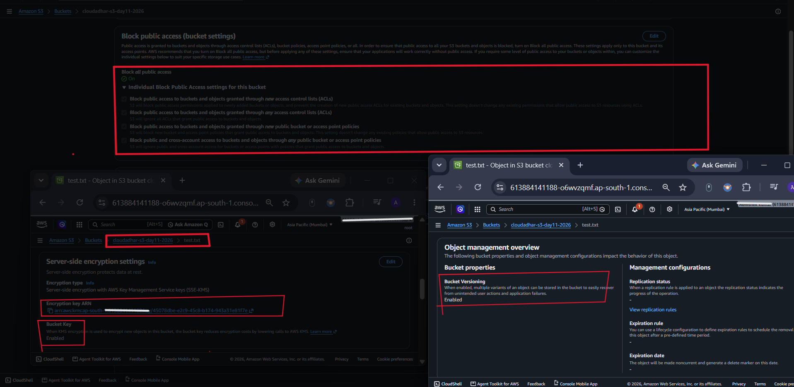

---

### 4. S3 Prefixes and Storage Classes

Set up the required S3 prefixes:

- `documents/`
- `versions/`
- `logs/`
- `storage/`
- `presigned/`

Uploaded the demonstration objects and checked their storage classes — `standard-demo.txt` on S3 Standard and `intelligent-tiering-demo.txt` on S3 Intelligent-Tiering.

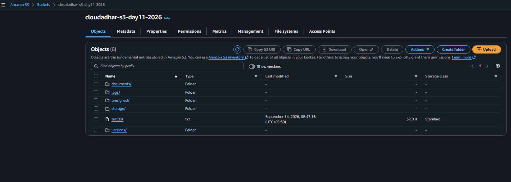

---

### 5. Version 1 Upload

Uploaded `version-demo.txt` with Version 1 content under the key `versions/version-demo.txt`.

**Version ID:** Captured and confirmed in the S3 console.

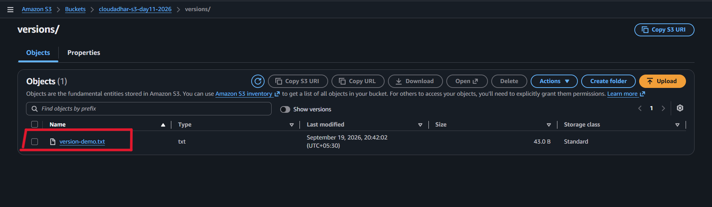

---

### 6. Version 2 Upload

Uploaded Version 2 to the same object key `versions/version-demo.txt`.

Turned on **Show versions** and confirmed two independent versions existed with distinct Version IDs, Version 2 being the current one.

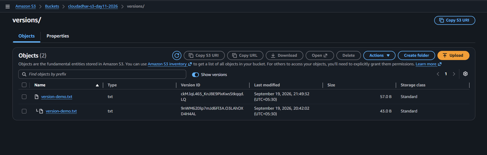

---

### 7. Delete Marker and Version Recovery

Deleted `version-demo.txt` normally and confirmed it disappeared from the standard object listing.

Turned on **Show versions**, located the delete marker, and permanently removed just that marker.

Confirmed the earlier Version 2 data became the current object again.

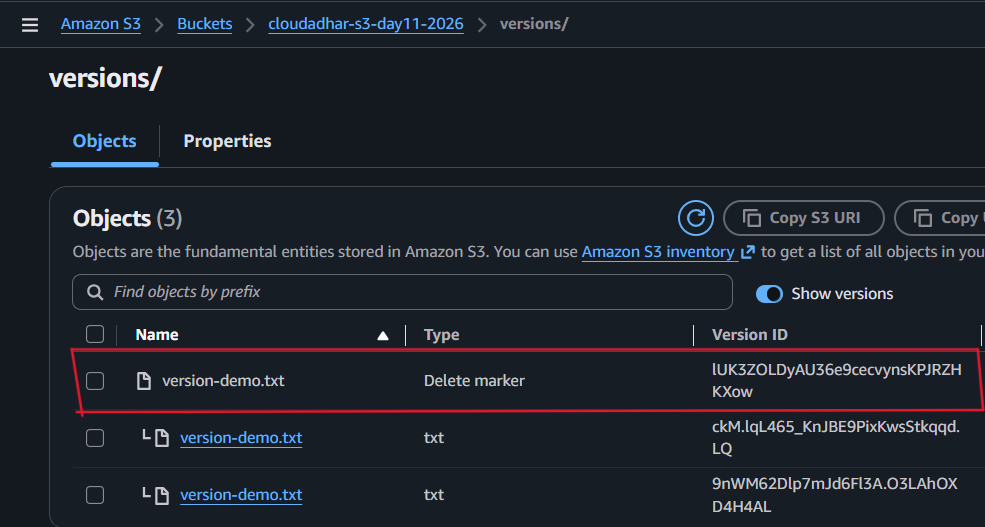

---

### 8. In-Bucket Object Copy

Copied `documents/private-report.txt` into the same bucket under a `copied/` prefix.

Confirmed `copied/private-report.txt` landed as its own independent object with its own Version ID, encrypted using SSE-KMS and the Day 11 customer managed KMS key.

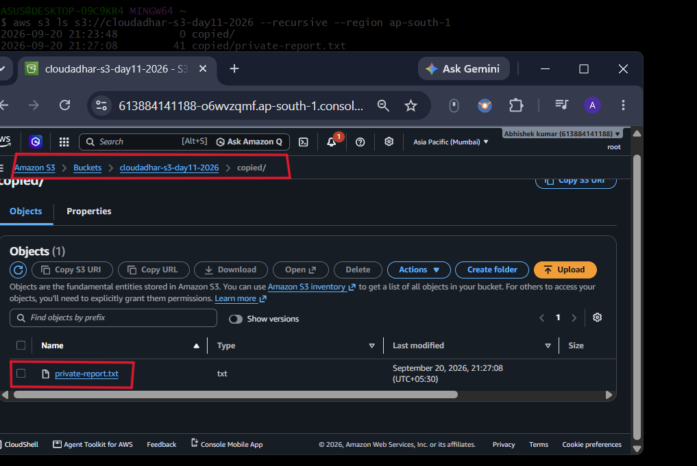

---

### 9. Private Object Access

Opened the plain S3 Object URL for `private-report.txt` in an incognito window.

Confirmed anonymous access was blocked with **AccessDenied** while Block Public Access stayed enabled.

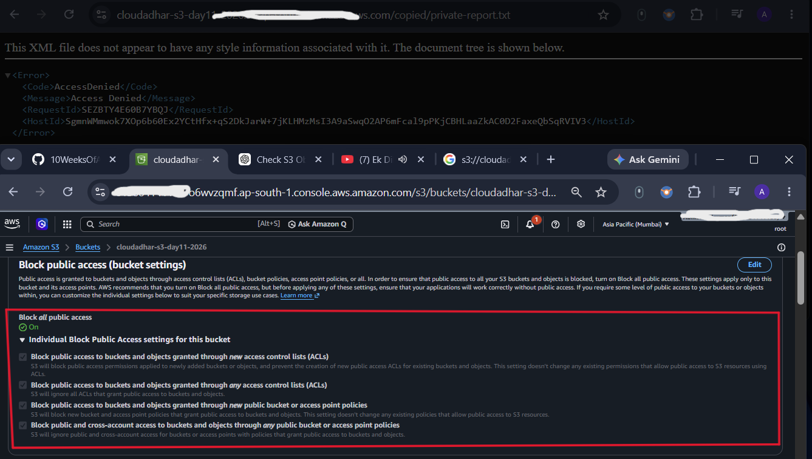

---

### 10. Block Public Access Protection

Ran a controlled test attempting a public-read policy while all four Block Public Access controls stayed on.

Confirmed S3 rejected the attempt and no public policy was left in place afterward.

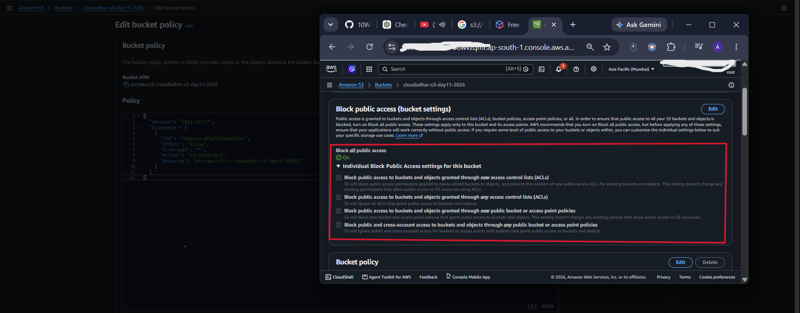

---

### 11. Presigned URL Validation

Generated a short-lived, 60-second presigned GET URL for `documents/private-report.txt`.

Confirmed the object opened fine via the presigned URL in an incognito window, while the plain Object URL still returned `AccessDenied`.

After the URL expired, refreshed it and confirmed it no longer worked.

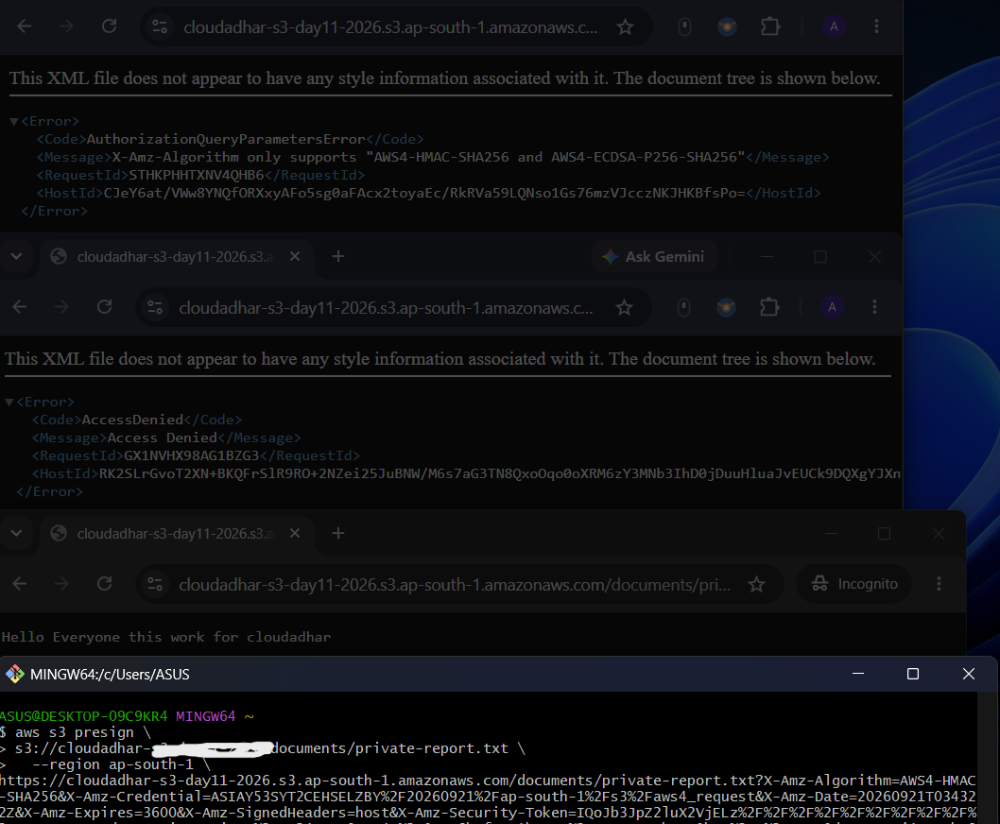

---

### 12. Lifecycle Management

Created the Lifecycle Rule `logs-transition-and-cleanup`, scoped to just the `logs/` prefix.

Set current-version transitions to Standard-IA after 30 days, Glacier Flexible Retrieval after 90 days, and expiration after 365 days.

Set noncurrent-version transition to Standard-IA after 30 days and permanent deletion after 90 days, plus cleanup of incomplete multipart uploads after 7 days.

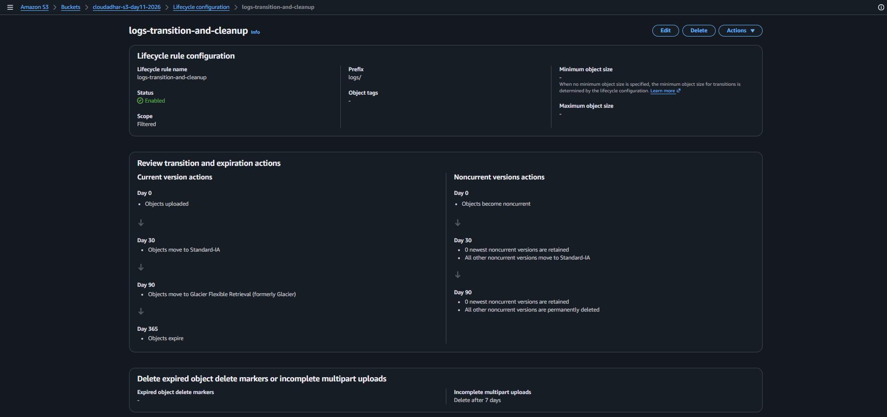

---

### 13. Object Lock Bucket

Created a separate Object Lock bucket `cloudadhar-s3-day11-lock-anand-2026` with Bucket owner enforced, ACLs disabled, all Block Public Access settings on, Versioning enabled, and Object Lock turned on.

No default Compliance-mode retention was set.

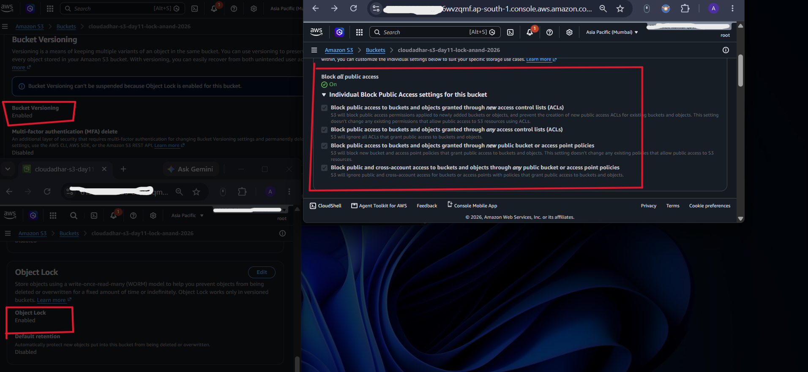

---

### 14. Legal Hold Applied

Uploaded `retention-demo.txt` into the `lock/` prefix and turned on **Legal Hold** for that specific object version.

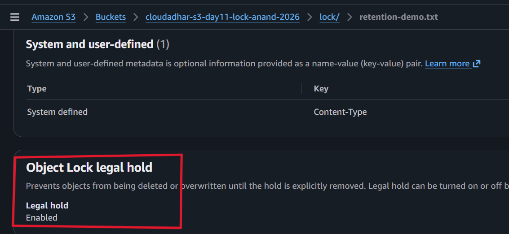

---

### 15. Legal Hold Prevents Deletion

Tried permanently deleting the protected object version while Legal Hold was active.

Confirmed the deletion was blocked because the version was under Legal Hold.

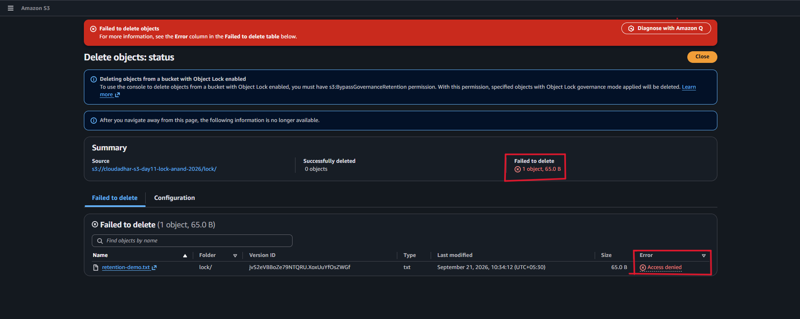

---

### 16. Legal Hold Removed and Cleanup

Removed the Legal Hold and then permanently deleted that exact object version.

Confirmed the deletion went through once Legal Hold was off and no retention period was blocking it.

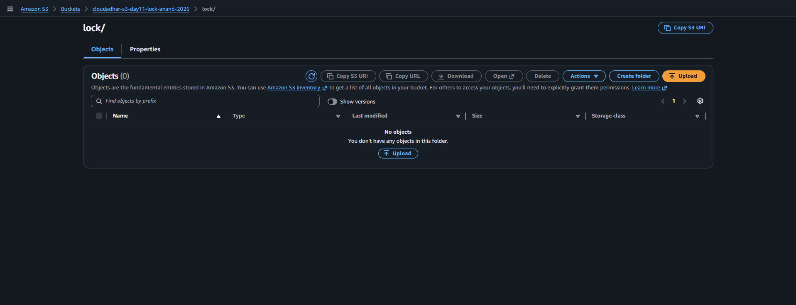

---

## Cleanup

**S3 resource cleanup (in order):**

1. Removed the Lifecycle Rule `logs-transition-and-cleanup`
2. Removed all demonstration objects and object versions from the source bucket, including `copied/private-report.txt` and any leftover delete markers
3. Removed `retention-demo.txt` and its version from the Object Lock bucket after lifting the Legal Hold
4. Deleted the Object Lock bucket `cloudadhar-s3-day11-lock-anand-2026`
5. Deleted the source bucket `cloudadhar-s3-day11-2026`
6. Confirmed no leftover Day 11 S3 buckets, objects, or lifecycle rules remained

---

## LinkedIn Post
[LinkedIn Link](YOUR_LINKEDIN_POST_URL_HERE)
